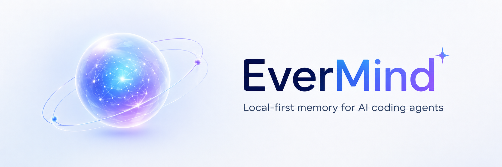

<div align="center">



**Local-first 6-layer AI memory system for coding agents.**  
Zero config. Zero cloud. Runs inside Claude Code, Cursor, and Codex.

[](https://www.python.org/)
[](https://modelcontextprotocol.io/)
[](docs/architecture.md)
[](#architecture)
[](LICENSE)
[](scripts/setup-windows.ps1)
[](scripts/setup-macos.sh)

[Quick Start](#quick-start) · [Architecture](#architecture) · [Tools](#mcp-tools) · [Setup](#setup) · [Docs](docs/README.md) · [简体中文](README.zh-CN.md) · [繁體中文](README.zh-TW.md) · [日本語](README.ja.md)

</div>

---

## What is EverMind?

EverMind gives AI coding agents persistent memory across sessions. It embeds directly into Claude Code, Cursor, and Codex via MCP — no cloud, no separate server, no API keys required, no configuration beyond pointing it at your repo.

Memory is organized into 6 layers modeled after how humans store knowledge: working notes that expire, episodic events, semantic facts, procedural knowledge, permanent archive decisions, and a graph of entity relationships. The right layer is chosen automatically based on content and importance.

## The Problem

AI agents forget everything between sessions:

- Why a module was designed a certain way
- Which command actually builds or tests the project
- Known bugs and the fixes that worked
- Deployment procedures and pitfalls
- Personal preferences and coding conventions

EverMind solves this by giving agents a reliable place to store and retrieve that knowledge.

## Architecture

```text
          Claude Code / Cursor / Codex
                     |
                  MCP (stdio)
                     |
           +-----------------------+
           |   EverMind v2 Core    |
           |                       |
           |  remember / recall    |
           |  forget  / briefing   |
           +-----------+-----------+
                       |
           +-----------v-----------+
           |   SQLite              |
           |   (one file/project)  |
           |                       |
           |  Layer 1: working     |  24h auto-expire
           |  Layer 2: episodic    |  events & discoveries
           |  Layer 3: semantic    |  project facts
           |  Layer 4: procedural  |  how-to knowledge
           |  Layer 5: archive     |  permanent decisions
           |  Layer 6: graph       |  entity relationships
           |                       |
           |  FTS5 keyword search  |
           |  sqlite-vec KNN       |
           |  event log            |
           +-----------------------+
```

Storage: `~/.evermind/<project-slug>.db` — one SQLite file per project, name auto-detected from git remote.

## Quick Start

### 1. Clone

```bash
git clone https://github.com/YPYT1/EverMind.git
cd EverMind
```

### 2. Run the setup script

**Windows:**

```powershell
powershell -ExecutionPolicy Bypass -File scripts\setup-windows.ps1
```

**macOS / Linux:**

```bash
bash scripts/setup-macos.sh
```

The script checks Python 3.11+, installs uv if missing, syncs dependencies, and auto-configures Claude Desktop and Cursor.

### 3. Manual config (optional)

Add to your `claude_desktop_config.json`:

```json
{
  "mcpServers": {
    "evermind": {
      "command": "uv",
      "args": ["run", "--directory", "/path/to/EverMind/mcp", "evermind-mcp"]
    }
  }
}
```

Replace `/path/to/EverMind` with the actual clone path. That is the only required change.

### 4. Enable vector search (optional but recommended)

```bash
cd mcp
uv pip install sqlite-vec sentence-transformers
```

Without these, EverMind uses FTS5 keyword search. With them, `recall()` runs hybrid BM25 + vector KNN — significantly better for semantic queries like "what did we decide about the auth module".

## MCP Tools

| Tool | Purpose |
|------|---------|
| `remember(content, importance, tags)` | Save to memory. importance: 0 = working (24h), 1 = long-term, 2 = permanent |
| `recall(query, limit, mode)` | Hybrid BM25 + semantic search. Auto-detects project from git |
| `forget(id)` | Delete a memory by ID |
| `briefing()` | Load session context: recent + important memories for this project |

Memory type is auto-detected from content: bug fixes → episodic, architecture decisions → semantic, deploy steps → procedural. Set `importance=2` for things you never want deleted.

## Setup

### Windows

```powershell
powershell -ExecutionPolicy Bypass -File scripts\setup-windows.ps1
```

What the script does:
- Checks Python 3.11+, uv, git
- Offers to install uv if not found
- Runs `uv sync` in the mcp directory
- Auto-updates Claude Desktop and Cursor MCP configs
- Creates `~/.evermind` memory directory

### macOS

```bash
bash scripts/setup-macos.sh
```

Same steps as Windows, using macOS config paths (`~/Library/Application Support/Claude/`).

### Manual install

```bash
# Install dependencies
uv sync --directory mcp

# Optional: vector search (recommended)
cd mcp && uv pip install sqlite-vec sentence-transformers
```

## Memory Lifecycle

| Layer | Retention | Use for |
|-------|-----------|---------|
| working | 24 hours | Temporary notes, WIP context |
| episodic | Long-term | Events, bug fixes, discoveries |
| semantic | Long-term | Facts about the project |
| procedural | Long-term | Deploy steps, workflows, how-to |
| archive | Permanent | Architecture decisions, permanent rules |
| graph | Permanent | Entity relationships (Phase 3) |

- `importance=0` — working layer (default, expires in 24h)
- `importance=1` — long-term layer (auto-classified by content type)
- `importance=2` — archive layer (never deleted)

## Agent Instructions

Add to `CLAUDE.md` or `AGENTS.md`:

```markdown
## EverMind Memory

Call briefing() at session start to restore project context.
Call remember(content) for anything worth keeping across sessions.
Call recall(query) before starting work on a feature or bug.

importance=0: temporary working note (default)
importance=1: long-term memory
importance=2: permanent archive (architecture decisions, critical bugs)
```

## Docs

- [Architecture](docs/architecture.md)
- [MCP Tools Reference](docs/mcp-tools.md)
- [Configuration](docs/configuration.md)
- [Quickstart Windows](docs/quickstart-windows.md)
- [Quickstart macOS](docs/quickstart-macos.md)
- [Troubleshooting](docs/troubleshooting.md)
- [v2 Redesign Notes](docs/v2-redesign.md)

---

## Community & Support

<div align="center">

<table>
<tr>
<td align="center">
<br/>
<sub>Community Group</sub>
</td>
<td align="center">
<br/>
<sub>WeChat</sub>
</td>
<td align="center">
<br/>
<sub>Buy me a coffee ☕</sub>
</td>
</tr>
</table>

Built for engineers who want their AI tools to actually remember things.

</div>
